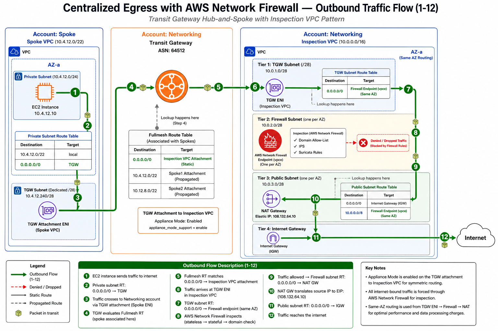
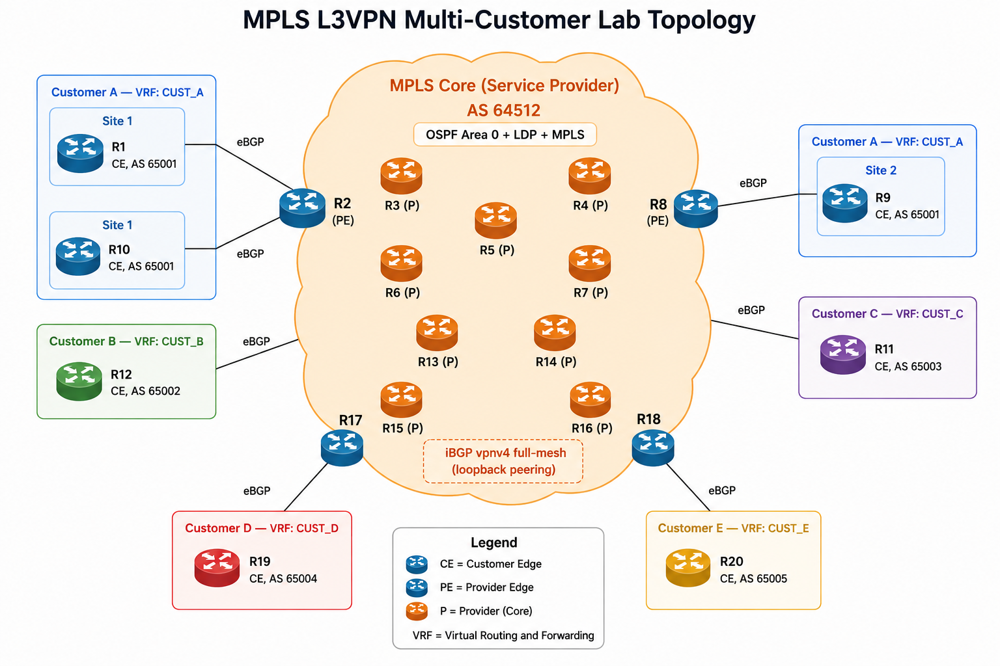
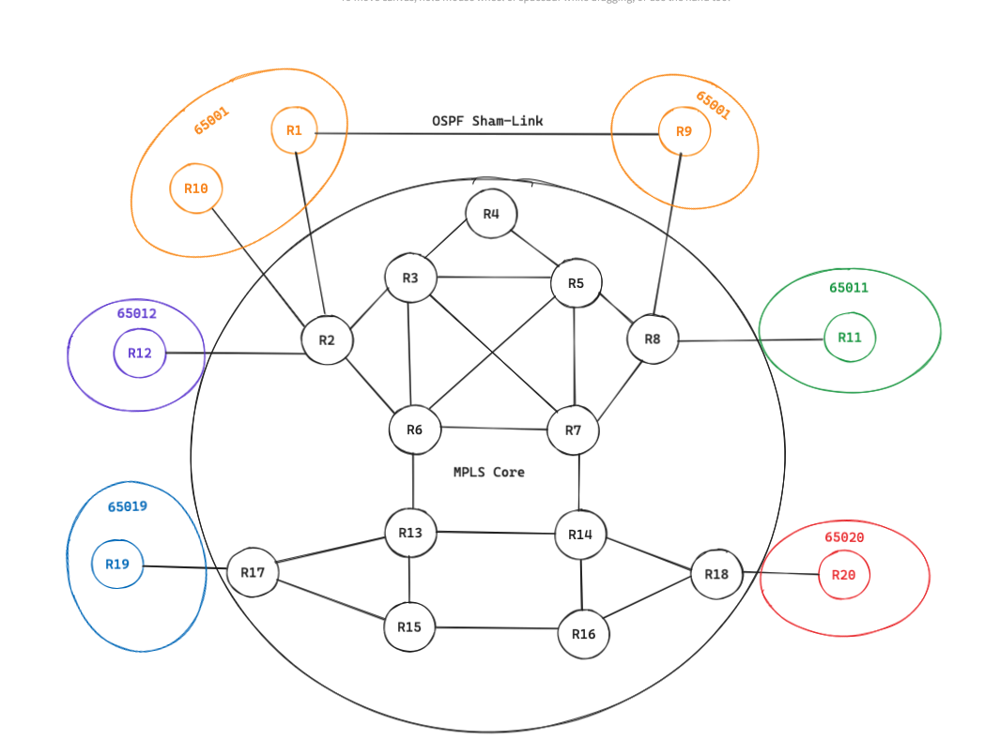

# Architecture Documentation

## Network Diagrams

### AWS Centralized Egress with Network Firewall

Full traffic flow showing spoke VPCs → Transit Gateway → Inspection VPC → AWS Network Firewall → NAT Gateway → Internet. Includes TGW route tables, firewall subnet routing, and return path.

- [Editable draw.io file](centralized-egress-flow.drawio)

---

### MPLS L3VPN Multi-Customer Lab Topology

Service provider MPLS core (AS 64512) with 4 PE routers serving 5 customers across multiple sites. Used for MPLS fundamentals, L3VPN, traffic engineering, and BGP design labs.

---

### GNS3 Lab — Physical Topology with Interconnections

Full 20-router GNS3 topology showing all physical links, interface names, and IP addressing between P, PE, and CE routers.

---

## Design Decisions

| Decision | Rationale |
|----------|-----------|
| Transit Gateway over VPC Peering | Centralized routing, segmentation, inspection path |
| IPAM for CIDR management | Avoid overlap, automated allocation across accounts |
| Centralized egress through inspection VPC | Single point for firewall policy, domain filtering, IPS |
| Python/Netmiko over Ansible | GNS3 local uses telnet consoles, Ansible requires SSH |
| Terraform state as source of truth for drift detection | Eliminates manual YAML maintenance |

## Topology Summary

| Environment | Purpose | Key Components |
|-------------|---------|----------------|
| AWS (eu-west-1) | Production network platform | TGW, Inspection VPC, Network Firewall, NAT GW, spoke VPCs |
| GNS3 (local) | MPLS/BGP lab + Python automation | 20 Cisco routers, MPLS core, L3VPN, Netmiko automation |
| EVE-NG (c5.metal, on-demand) | Advanced labs | EVPN/VXLAN, Segment Routing, VPN to AWS |
